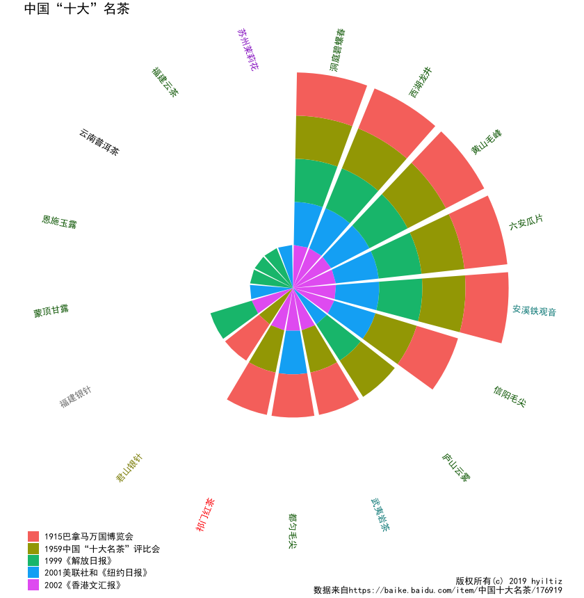

# Chinese Top Ten Teas

## Classification

Chiense teas are classified based on production sites and the production methods.
A tea name usually starts with its production site, followed by its name used
by the locals at that site. Based on the production method, a Chinese tea can be classified
into the following classes:

- 绿茶(Green)
- 红茶(Red)
- 黑茶(Black)
- 乌龙茶(Oloong)
- 黄茶(Yellow)
- 白茶(White)
- 花茶(Flower)
- 普洱茶(Puer)

## Evaluation

According to the data from [a Chinese (Baidu) wiki page][1], Top ten teas were selected by several media sources including New York Times (2001), Hong Kong Wen Wei Po 2002, and during Panama–Pacific International Exposition (1915), China Top Ten Tea Evaluation Contest (1959). 

I looked up the classification of each of the "top ten" teas. The tea names are color coded with
their respective tea class.

## Figures and tables

[Higher resolution](./chinese-famous-teas.pdf)

[Higher resolution](./chinese-famous-teas-grid.pdf)

### Tea laderboard

|name (Chinese) | times selected|type   |
|:----------|-----------:|:------|
|洞庭碧螺春 |           5|Green  |
|西湖龙井   |           5|Green  |
|洞庭碧螺春 |           5|Green  |
|黄山毛峰   |           5|Green  |
|西湖龙井   |           5|Green  |
|洞庭碧螺春 |           5|Green  |
|西湖龙井   |           5|Green  |
|洞庭碧螺春 |           5|Green  |
|洞庭碧螺春 |           5|Green  |
|西湖龙井   |           5|Green  |
|黄山毛峰   |           5|Green  |
|黄山毛峰   |           5|Green  |
|黄山毛峰   |           5|Green  |
|六安瓜片   |           5|Green  |
|黄山毛峰   |           5|Green  |
|六安瓜片   |           5|Green  |
|西湖龙井   |           5|Green  |
|安溪铁观音 |           5|Oolong |
|六安瓜片   |           5|Green  |
|六安瓜片   |           5|Green  |
|安溪铁观音 |           5|Oolong |
|安溪铁观音 |           5|Oolong |
|安溪铁观音 |           5|Oolong |
|六安瓜片   |           5|Green  |
|安溪铁观音 |           5|Oolong |
|信阳毛尖   |           4|Green  |
|信阳毛尖   |           4|Green  |
|信阳毛尖   |           4|Green  |
|信阳毛尖   |           4|Green  |
|庐山云雾   |           3|Green  |
|武夷岩茶   |           3|Oolong |
|都匀毛尖   |           3|Green  |
|祁门红茶   |           3|Red    |
|祁门红茶   |           3|Red    |
|庐山云雾   |           3|Green  |
|都匀毛尖   |           3|Green  |
|武夷岩茶   |           3|Oolong |
|都匀毛尖   |           3|Green  |
|武夷岩茶   |           3|Oolong |
|祁门红茶   |           3|Red    |
|庐山云雾   |           3|Green  |
|君山银针   |           2|Yellow |
|福建银针   |           2|White  |
|君山银针   |           2|Yellow |
|福建银针   |           2|White  |
|蒙顶甘露   |           1|Green  |
|恩施玉露   |           1|Green  |
|云南普洱茶 |           1|Puer   |
|福建云茶   |           1|Green  |
|苏州茉莉花 |           1|Flower |

[1]: https://baike.baidu.com/item/中国十大名茶/176919
